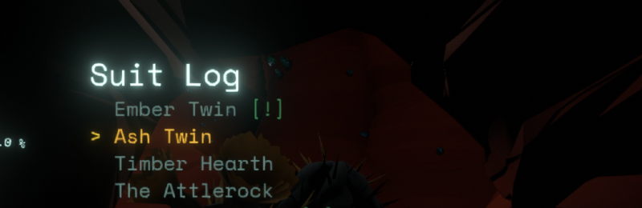
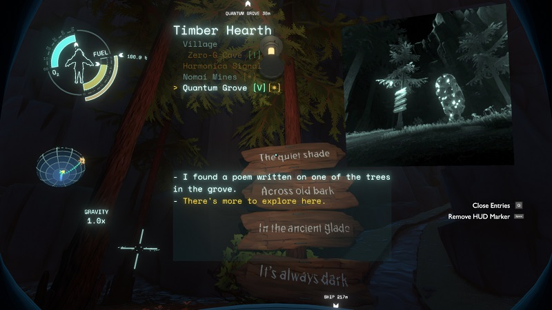

# Suit Log by Damián Garro

Tired of having to go to the ship again and again just to check any data in the Ship Log? Not anymore! With Suit Log you just need to **suit up**, go out to have your adventures without annoying interruptions and check the data you want at any time!

Demo video: https://www.youtube.com/watch?v=Xpf7Rwy12Bk

You don't have to learn anything to use this new interface, the controls are the same as in the Ship Log! Just use the autopilot key to open it (**X key** in the keyboard or **up D-pad button** in the gamepad by default).  You'll have everything you need right there: entries with their photos, "icons", marking location in HUD...

And all of this displayed in a diegetic interface that shares design with the other HUD elements displayed on the helmet, intended to feel like a vanilla feature and not an external add-on!

*Note:* Only Map Mode is included in Suit Log, you will still need the to use the Ship Log for the Rumor Mode. The "map" is different here though, the planets (and other locations) are displayed as a list, where you can select one to view the list of its entries.

Entries you read will be marked as read the same way the Ship Log does it, although it is planned to make this optional in a future update. Other future updates could include the option of pausing the game while using the Suit Log and disabling the display of entry photos if you want a simplified alternative.

If you want to use the Suit Log in the few places where you can't have the Suit on, I recommend using the [Cheat And Debug Menu](https://outerwildsmods.com/mods/cheatanddebugmenu/) mod, pressing the **F2 key** to put on the suit, although I may add the option to be able to open the Suit Log even without the suit  as a *cheat mode*.

Please, I'd be happy to receive any suggestions and bug reports on [GitHub](https://github.com/dgarroDC/SuitLog/issues) or in the [Outer Wilds Modding Discord Server](https://discord.gg/9vE5aHxcF9). Thanks.

## Compatibility and interactions with other mods

* [Archaeologist Achievement Helper](https://outerwildsmods.com/mods/archaeologistachievementhelper/): The mods are compatible and if you run the game with Suit Log and this helper mod, the later would add the *"There's more to explore here."* mark and text to entries to both the Ship Log and Suit Log. However, the *"Show all missing facts"* optional feature only applies to the Ship Logs and the Suit Log would be unaffected by this.
* [New Horizons](https://outerwildsmods.com/mods/newhorizons/): The mods are fully compatible, opening the Suit Log shows planets added by addons of New Horizons if they have entries. The menu list only displays the planets of the current star system (this is the same behaviour that the Ship Log has in New Horizons). Entries added to the vanilla Outer Wilds planets are also listed.
